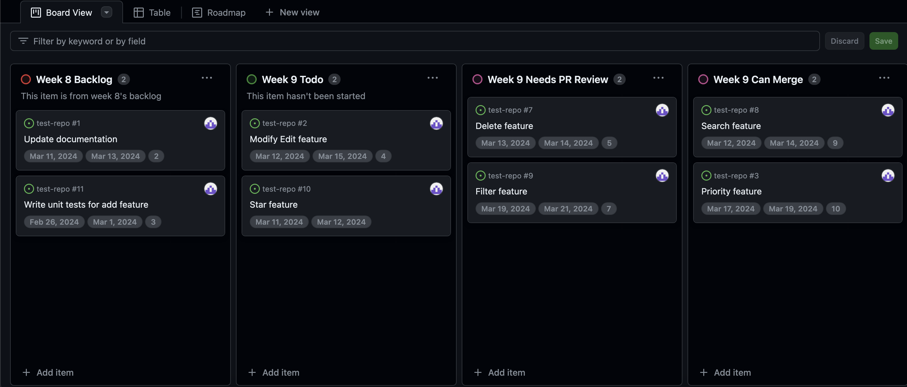

<frontmatter>
  title: Home Page
  layout: default.md
  pageNav: 4
  pageNavTitle: "Topics"
</frontmatter>

## Table of Contents
* [Overview of GitHub Project Boards](#overview-of-github-project-boards)
* [Overview of Features](#overview-of-features)
  * [Adding Custom Fields to Tasks](#adding-custom-fields-to-tasks)
  * [Visualisation of Tasks in Different Formats](#visualisation-of-tasks-in-different-formats)
  * [Automated Insights](#automated-insights)
  * [Creating Automated Workflows](#creating-automated-workflows)
* [Why Is It Useful for Team Projects?](#why-is-it-useful-for-team-projects)
* [Potential Drawbacks](#potential-drawbacks)

--------------------------------------------------------------------------------------------------------------------

## Overview of GitHub Project Boards

GitHub Project Boards is a project management tool integrated within GitHub, designed to assist teams in planning, 
tracking, and managing their work. It offers visual interfaces of various formats for organising tasks, including 
issues and pull requests, with statuses that represent different stages of the project (e.g. Backlog, Todo, etc).

---

## Overview of Features

GitHub Project Boards offers several useful features. The main features include the ability to add custom fields to tasks, visualise
tasks in different formats, view automatically generated insights and create automated workflows.

##### Adding Custom Fields to Tasks

Users can link custom fields to <tooltip content="Tasks include an issue or a pull request.">tasks</tooltip>. For example, a user can link a start date, end date and estimated completion 
hours to an issue.

##### Visualisation of Tasks in Different Formats

Tasks can be visualised in different formats, such as Board View, Table View, and Roadmap View, offering versatile 
perspectives for project management. 

* In Board View, each task has a status and tasks are grouped and displayed by their 
status. This feature streamlines monitoring by categorising tasks into statuses like Backlog, Todo, Needs PR Review, 
Done and Up Next. 

* Table View allows for a full overview of all tasks, which is like an automated version of a 
table/excel spreadsheet, ensuring easy access to task details at one glance. 

* Roadmap View displays tasks in sequential order based on planned timelines, which can make use of the start and end date 
custom fields.

##### Automated Insights

GitHub Project Boards also offers ‘Insights’ such as automatically showing workload distribution by assigned person 
and distribution of tasks by status in the form of bar charts.

##### Creating Automated Workflows

Users can streamline task-related workflows. 

For instance, workflows can be configured to automatically add newly created issues or pull requests to the GitHub 
Project Board, fostering efficiency in task management.

Users can also establish automated processes where the status of a task changes to 'Done' upon issue closure
or pull request merge, seamlessly relocating it within Board View.

---

## Why Is It Useful for Team Projects?
 

* **Manage Tasks Timely Within Each Milestone**
  * While milestones help track groups of tasks, GitHub Project Boards provide detailed tracking of tasks within 
  each milestone of the project. This allows for progress monitoring within milestones and supports the iterative and
  incremental development process.
  * GitHub Project Boards reduces the need for manual oversight by using workflows to automatically update task 
  statuses to 'Backlog', 'To-Do', 'Up Next', etc. This allows users to maintain an organised task list with less 
  effort, ensuring tasks are prioritised and completed within milestone deadlines.

 

* **Centralised Project Management**
  * All team members can access and update the project board, ensuring everyone is on
    the same page regarding task progress and status, removing areas of confusion.
  * Direct integration with the code repository makes it easy to manage both development work and project tasks 
  automatically in one location. This eliminates the need for separate tools and, by automating workflows, reduces 
  the risk of human error, such as forgetting to update groupmates on progress.

 

* **Fair Division of Workload**
  * Using 'Insights', GitHub Project Boards enables groups to track the distribution of workload across all members. 
  This helps ensure that everyone is contributing evenly and that no single member is overloaded, achieving a fair 
  division of tasks.

 

* **Reduce Merge Conflicts**
  * By enabling users to schedule timelines for individual issues, users can anticipate potential merge conflicts and
    plan their tasks such that they can reduce merge conflicts as much as possible, promoting smoother collaboration and
    enhancing project efficiency.

---

## Potential Drawbacks
 

* Managing and navigating another tool can lead to greater workload, especially after 
already being accustomed to existing tools or having to juggle between multiple tools.

 

* Time and effort is needed to become familiarised with its features. The learning curve associated 
with learning this new tool may initially slow down productivity while adapting to using the tool.